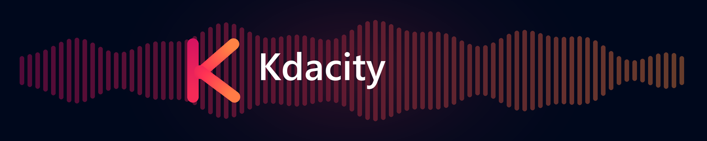

<p align="center">
  
</p>

<h1 align="center">Kdacity</h1>

<p align="center"><em>The new Audacity, kept offline and private like old times.</em></p>

---

Kdacity is an unofficial fork of [Audacity 4](https://github.com/audacity/audacity) with every
online feature and promotional surface removed. It is the Audacity 4 editor — the new Qt/QML
interface, the same audio engine — with nothing that talks to a server, advertises a store, or
reports anything about you.

This is a fork for people who want the new Audacity and do not want an account, a cloud, an
update checker, a plugin storefront, or telemetry.

## What is different

| Upstream Audacity 4 | Kdacity |
| --- | --- |
| Save to cloud / audio.com account | Removed. Projects save to disk, and the "local or cloud?" prompt is gone rather than shown with one option |
| Share audio to audio.com | Removed |
| "Get effects" MuseHub storefront in the toolbar | Removed, along with the `au3-musehub` library |
| Welcome carousel (release video, cloud setup, plugin ads, survey) | Removed entirely |
| Update checker + a 12-hour background re-check timer | Removed |
| Crash reporting and anonymous usage telemetry | Removed, including the preference toggles |
| Online translation downloads in Preferences | Removed; the shipped translations are the translations |
| Sign-in and "app updates & usage info" pages in first-run setup | Removed; first run is theme, clips and layout only |
| Publish page, account page, cloud project tabs | Removed |
| Online handbook / Ask for help web links | Removed |

Nothing above is greyed out or hidden behind a flag. The code is gone, and the modules that
implement it — cloud, update, learn, tours, musesampler, network, crashpad, usage info — are
forced off in [`CMakeLists.txt`](CMakeLists.txt) with a comment explaining why re-enabling any
one of them requires removing the matching UI as well.

The About dialog now says what the app actually does:

> Kdacity works entirely offline. It has no accounts, no cloud storage, no update checks,
> no crash reporting and no usage tracking. Nothing you record or edit ever leaves this computer.

### Honest caveats

* This is a feature removal, not a security audit. Some unreachable cloud error strings still
  exist in the binary in code paths that no UI can reach, and the vendored Muse framework still
  contains one unused `museHubWebUrl()` accessor with no callers.
* Third-party plugins you install yourself (VST3, LV2, Nyquist) run their own code and may do
  their own networking. Kdacity does not sandbox them.
* Optional FFmpeg support still loads `avformat` from your system if you install it. That is a
  local library load, not a download — Kdacity never fetches it for you.

## Status

| Platform | State |
| --- | --- |
| Windows x64 | Built, run and packaged. This is the platform the fork is developed on. |
| Linux / macOS | Should build — the removals are platform-neutral — but are **untested**. Reports welcome. |

Kdacity tracks Audacity 4, which upstream still describes as undergoing major structural change.
Treat it accordingly: it is a capable editor, not a finished release.

## Install

Grab the Windows installer from the [Releases page](https://github.com/kcorp404/Kdacity/releases),
or build it yourself — see [BUILDING.md](BUILDING.md).

The installer is unsigned. Windows SmartScreen will warn you; that is expected for an
independently built application, and you can inspect exactly what goes into it in
[`buildscripts/packaging/Windows/Installer/Kdacity.iss`](buildscripts/packaging/Windows/Installer/Kdacity.iss).

## Building

```bash
git clone --recurse-submodules https://github.com/kcorp404/Kdacity.git
```

Full instructions, including the two build-system quirks that will otherwise cost you an
afternoon, are in [BUILDING.md](BUILDING.md).

## Relationship to upstream

Kdacity is a fork of [audacity/audacity](https://github.com/audacity/audacity) (the `master`
branch, which is Audacity 4). It carries:

* **Audacity 3** sources under [`au3/`](au3), vendored in-tree as upstream does.
* The **Muse framework** and its dependencies as git submodules pointing at
  [musescore/muse_framework](https://github.com/musescore/muse_framework) and
  [musescore/muse_deps](https://github.com/musescore/muse_deps).

All credit for the application belongs to the Audacity team, Muse Group and the many
contributors listed in the About dialog and in [`CHANGELOG.txt`](CHANGELOG.txt) — that changelog
is upstream Audacity's history, not this fork's.

### Not affiliated

**Kdacity is not affiliated with, endorsed by, or supported by the Audacity project, Muse Group,
or MuseScore.** "Audacity" is a trademark of its owner. Please do not report Kdacity bugs to the
Audacity issue tracker or forums — [open them here](https://github.com/kcorp404/Kdacity/issues)
instead, and do not ask the upstream project to support this build.

## License

Kdacity is licensed **GPLv3**, unchanged from upstream. Most code files are GPLv2-or-later, with
the notable exceptions of the bundled third-party libraries under [`thirdparty/`](thirdparty) and
VST3-related code, which carry their own licences. Documentation is CC-BY 3.0 unless otherwise
noted. Full details are in [LICENSE.txt](LICENSE.txt).

Licences for the libraries redistributed with a built copy are installed alongside the
application in `licenses/`.

Because this is a GPL work, the modified source is published here in full, which is what the
licence requires and what makes the claims on this page checkable rather than something you have
to take on trust.
